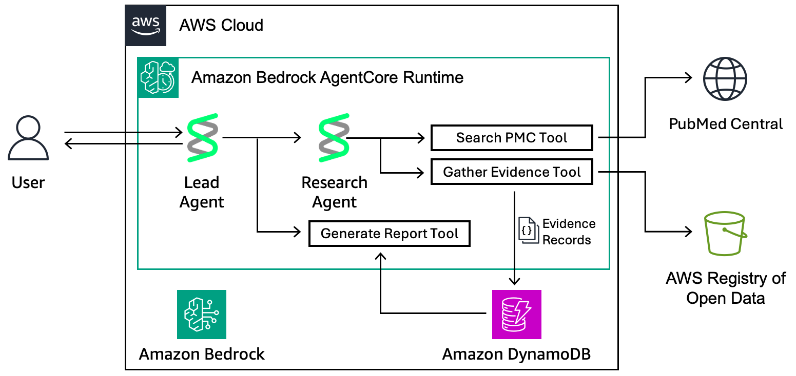

# Best Practices for Life Science Research Agents on AWS

## Summary

Learn how to build and deploy AI agents for life science research. AI research agents speed up scientific discovery by planning research tasks, interacting with domain-specific tools and data, and generating detailed research reports. This hands-on workshop will cover current best practices for building AI research agents. Through interactive demonstrations and hands-on exercises, you'll learn how to use AWS services like Amazon Bedrock AgentCore and open source frameworks like Strands Agents to deploy AI research teams securely and at scale. Then, you'll experiment with scientific tools and databases to answer your own research questions. Whether you're hunting for the next blockbuster drug or pushing the boundaries of basic research, you'll leave equipped with practical skills to accelerate your scientific pipeline.

## Getting Started

After cloning the [workshop code repository](https://github.com/aws-samples/sample-best-practices-for-life-science-research-agents) into your your JupyterLab environment, browse to **sample-best-practices-for-life-science-research-agents > labs > 01-agents > 01-pmc-abstract-search** to get started with this workshop.

## Architecture



## What's Included

- All required Python packages (strands-agents, boto3, etc.)
- Hands-on workshop notebooks and examples

## Project Structure

```bash
sample-best-practices-for-life-science-research-agents/
├── infrastucture/               # Example CloudFormation templates for workshop
└── labs/                        # Example notebooks
```

## Security

See [CONTRIBUTING](CONTRIBUTING.md#security-issue-notifications) for more information.

## License

This library is licensed under the MIT-0 License. See the LICENSE file.
